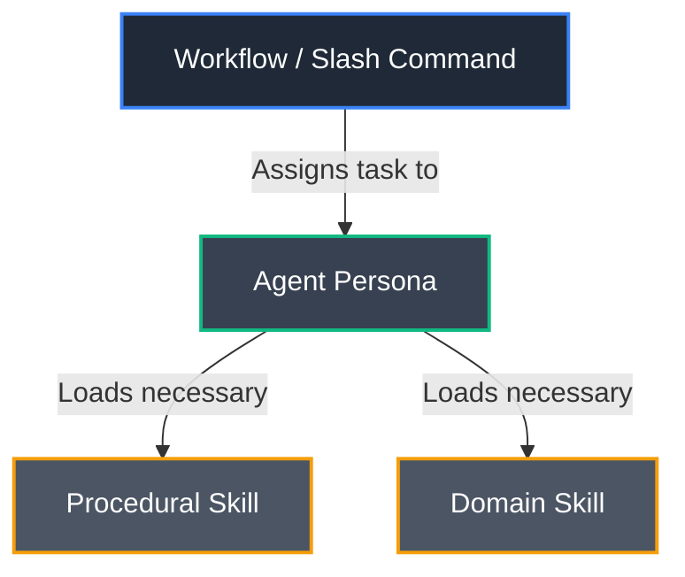
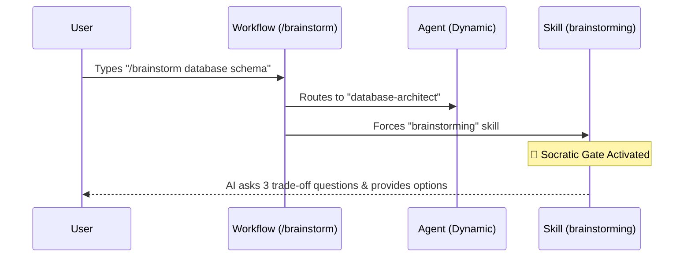
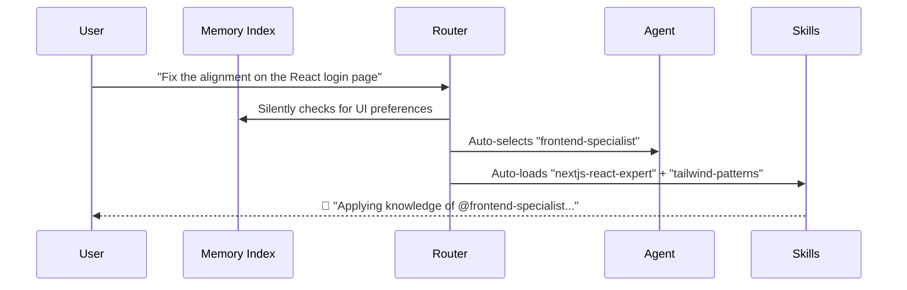

# AG Kit Overview

AG Kit is a comprehensive, modular framework designed to enhance AI coding capabilities by structuring behavior, knowledge, and processes into specialized components. This prevents the AI from acting as a generic "jack of all trades" and instead operates like an organized engineering team.

---

## 🏗️ Core Components

| Component | Description | Example |
| :--- | :--- | :--- |
| **🤖 Agents (20)** | Specialized personas the AI adopts based on the task. Sets focus and toolset. | `frontend-specialist`, `database-architect` |
| **🧩 Skills (47)** | Modular domains of knowledge loaded on-demand. Teaches "how to think" about a technology. | `tailwind-patterns`, `api-patterns` |
| **📜 Rules** | Strict behavioral constraints. Can be global or project-scoped. | `universal-rules.md`, `code-rules.md` |
| **🔄 Workflows (13)**| Structured, step-by-step procedures for complex tasks. | `/plan`, `/debug` |
| **🧠 Memory** | Persistent cross-session recall index that saves preferences and context. | `MEMORY.md` |
| **🛠️ Scripts** | Executable scripts to run real validation (lints, tests, security audits). | `checklist.py`, `verify_all.py` |

---

## ⚖️ The Execution Hierarchy

When thinking about how the system operates, it's best to view it as an **execution hierarchy** (how the components encapsulate one another) rather than a strict rule priority.

1. **Workflow (The Process):** Dictates the step-by-step procedure (e.g., Crisis-resolution debugging).
2. **Agent (The Persona):** Dictates *who* is executing the process (e.g., The debugger).
3. **Skills (The Knowledge):** Dictates *what* technical domain knowledge is used to accomplish it.

---

## 🔀 How Triggers Work: Workflows vs. Auto-Routing

A common point of confusion is how the 13 workflows map to the 47 skills. They do not map 1-to-1. 
- **Procedural Skills** are triggered explicitly by Workflows.
- **Domain Skills** are triggered implicitly by context via Auto-Routing.

### Scenario A: Explicit Workflow Trigger (`/brainstorm`)

When you type a slash command, it forces a specific procedural workflow.

### Scenario B: Implicit Auto-Routing (Context-based)

When you just talk normally, the system uses natural language processing to load domain skills.

---

## 🧠 The Memory System

The memory system prevents the AI from suffering amnesia between chat sessions. 

1. **Saving:** When you ask the AI to remember something (or use `/remember`), it creates a topic file (e.g., `user-preferences.md`) and logs a pointer in the lightweight `MEMORY.md` index.
2. **Recalling:** At the start of *every* session, the AI silently reads `MEMORY.md` to establish context before answering your first prompt.
3. **Manual Control:** You have full control. You can manually edit, delete, or prune any markdown files in the `.agents/memory/` directory to curate what the AI knows about your project.

> [!NOTE]
> The `.temp_ag_kit` folder is an artifact of the initial installation process. It is used temporarily to download the repository before copying `.agents` to your project root. If it is left over after `ag-kit init`, it can be safely deleted.
