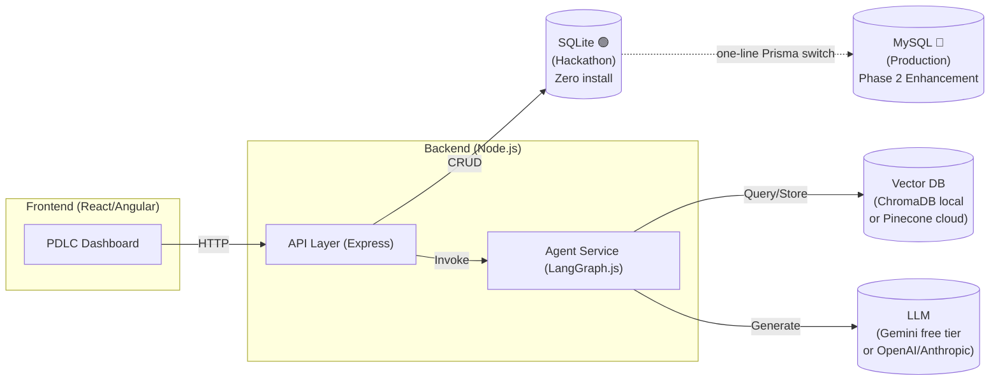

# Hackathon Plan: AI Across the PDLC

This document outlines a plan to build the **AI Across the Product Development Lifecycle (PDLC)** use case using a Node.js and React/Angular stack. 

## 1. Recommended Tech Stack (Hackathon Optimized)

*   **Frontend:** React (Next.js for speed) or Angular (if the team is faster with it).
*   **Backend:** Node.js with Express or NestJS.
*   **Agent Framework:** **LangGraph.js** (for robust state management and cyclical agent workflows) alongside LangChain.js, or **Vercel AI SDK**.
*   **Relational DB:** **SQLite** 🟢 for the hackathon (zero install, single `.db` file). **MySQL** 🔵 as the production upgrade path (one-line Prisma config change).
*   **Vector Database (RAG):** **ChromaDB** (local, 2 pip commands) or **Pinecone** (cloud, just an API key).
*   **PDF Generation:** **Puppeteer** (Node.js library, installed via npm — no extra setup). Renders an HTML report template server-side and produces a downloadable PDF.
*   **Observability:** **Langfuse** (free tier).

## 2. Architecture Blueprint



## 3. Phase-by-Phase Implementation Plan

### Phase 1: Foundation (Hours 1-4)
*   **Frontend:** Scaffold the React/Angular app. Build a simple dashboard to upload documents (requirements, designs) and view the status of the PDLC.
*   **Backend:** Set up a Node.js server with routes to handle document uploads.
*   **RAG Setup:** Implement text extraction for all supported formats and chunk the output into the Vector DB:

    | Format | Library |
    |---|---|
    | `.md` | `marked` |
    | `.pdf` | `pdf-parse` |
    | `.txt` | Node.js `fs.readFile` (no library needed) |
    | `.doc` / `.docx` | `mammoth` |

    > All parsed text passes through LangChain's `RecursiveCharacterTextSplitter` before being stored as chunks. Use `.docx` over `.doc` for more reliable Word extraction.

### Phase 2: Agent Development (Hours 4-12)
Build specific agents using LangGraph.js, mirroring the `AbstractAgent` pattern from `confia_ai`:
1.  **Requirement Refiner Agent:** Takes raw text, queries the Vector DB for context, and outputs structured, refined requirements (JSON).
2.  **Test Case Generator Agent:** Takes the refined requirements and generates a suite of test cases (unit, integration, e2e).
3.  **Traceability Agent (The Core):** A graph-based agent that analyzes the Vector DB (design docs vs. requirements vs. test cases) and outputs a Gaps Report JSON:
    ```json
    {
      "totalRequirements": 4,
      "covered": 2,
      "coveragePercent": 50,
      "existingTestCases": [
        { "testId": "Test-1", "description": "Verify email/password login succeeds" },
        { "testId": "Test-2", "description": "Verify dashboard load time is under 2 seconds" }
      ],
      "gaps": [
        { "reqId": "Req-2", "description": "Google OAuth login", "aiReason": "No test case found for OAuth flow" },
        { "reqId": "Req-4", "description": "Export reports as PDF", "aiReason": "No export-related test case found" }
      ],
      "suggestedTests": [
        { "forReqId": "Req-2", "testCase": "Verify user can sign in using Google OAuth button" },
        { "forReqId": "Req-4", "testCase": "Verify report downloads as a valid PDF file" }
      ]
    }
    ```
4.  **Report Generator Agent:** Takes the Gaps Report JSON, renders it into an HTML report template, and uses **Puppeteer** to produce a downloadable PDF. The PDF is the **primary deliverable** and includes:
    - Executive summary (coverage %, gap count)
    - Traceability matrix (req → test mapping)
    - Coverage gaps list with AI reasons
    - **All existing test cases** (uploaded by user)
    - **All AI-generated test cases** (suggested for gaps)

### Phase 3: Integration & UI Polish (Hours 12-18)
*   Connect the frontend to the agent endpoints.
*   **Dashboard Preview:** Create a traceability matrix UI with green/red indicators for requirement coverage.
*   **PDF Report Download:** Add a prominent "Download Coverage Report" button that calls `/api/report/:runId` and streams the Puppeteer-generated PDF to the browser. This is the deliverable judges interact with.
*   **Report contents:** Coverage %, gaps listing with AI reasons, full traceability matrix, AI-suggested test cases for each gap.
*   Add a chat interface allowing users to ask: *"Why did this requirement fail coverage?"* The agent answers using RAG.

### Phase 4: Final Presentation & Buffer (Hours 18-24)
*   Ensure **Langfuse** traces are visible (great for the demo to show the "brain" of the AI).
*   Prepare a realistic mock dataset (a fake software project with requirements and missing tests) to clearly demonstrate the problem and solution.
*   **Demo flow:** Upload docs → click Analyze → watch the agents run (Langfuse live) → click "Download Report" → open PDF on projector. Judges see: **50% coverage, 2 gaps flagged, AI-suggested fixes**.

## 4. Why These Tools?

| Tool | Why we use it |
|---|---|
| **RAG + Vector DB** | SQL matches exact words. Vector DB matches *meaning*. “Google Login” and “Verify OAuth sign-in” are the same concept — only a Vector DB finds that link automatically. |
| **LangGraph.js** | Manages the 4-agent pipeline as a state machine. Handles shared state, error recovery, and retries between agents — so you don’t wire it manually. |
| **Langfuse** | Records every LLM call (prompt in, output out, tokens, latency). Invaluable for debugging during build and visually impactful during the demo — judges watch agents run live. |
| **LangChain.js** | Saves ~200 lines of boilerplate. Provides one-liner connectors for ChromaDB, text chunking, and Gemini embeddings. Optional, but worth it for hackathon speed. |
| **Puppeteer** | Renders your HTML report template to a real PDF server-side. One `npm install` — no external service needed. |

## 5. Key Pitfalls to Avoid
*   **Don't build your own orchestrator:** Use LangGraph.js or Vercel AI SDK to manage prompt chains, state, and tool calling.
*   **Keep agents stateless:** Store all state (documents, generated tests) in your database or Vector DB, not in Node.js memory, mirroring the `confia_ai` stateless design.
*   **Don't set up PostgreSQL for the hackathon:** SQLite is zero-install and works identically through Prisma. Save PostgreSQL/MySQL for production.
*   **Don't skip Langfuse:** The live trace view during the demo is your "show the AI thinking" moment — judges love it.

---

## 5. Production Enhancements (Present During Demo)

Frame these as your **Phase 2 roadmap** to impress judges:

| Enhancement | What it unlocks | Complexity |
|---|---|---|
| **SQLite → MySQL** | Multi-user concurrency | One-line Prisma config change |
| **ChromaDB → Pinecone** | Cloud-scale vector search | API key swap |
| **Single server → Docker** | Portable, reproducible deployment | Medium |
| **In-memory → Redis** | Distributed agent state | Medium |
| **Gemini → GPT-4/Claude** | Higher accuracy traceability | API key swap |

> 🎯 **Talking point:** *"SQLite was a deliberate choice for hackathon speed. Upgrading to MySQL is a one-line change in our Prisma schema — the entire application layer remains untouched."*
